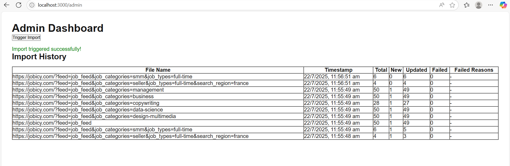

# Job Queue Handler

A scalable system for importing jobs from multiple external APIs, processing them via a queue, and tracking import history with a modern admin dashboard.

## Features
- Fetch jobs from multiple XML APIs and normalize to JSON
- Queue-based background processing with BullMQ and Redis
- Import jobs into MongoDB with upsert (new/updated)
- Import history tracking (total, new, updated, failed, reasons)
- Admin dashboard (Next.js) for monitoring and manual imports
- Scheduled imports via cron

## Tech Stack
- **Frontend:** Next.js (TypeScript)
- **Backend:** Node.js (Express)
- **Database:** MongoDB (Mongoose)
- **Queue:** BullMQ + Redis

## Quick Start

### Prerequisites
- Node.js 18+
- MongoDB (local or Atlas)
- Redis (local, Memurai, or Redis Cloud)

### Setup & Running the Project

1. **Clone the repository:**
   ```bash
   git clone https://github.com/<your-username>/JOB_QUEUE_HANDLER.git
   cd JOB_QUEUE_HANDLER
   ```

2. **Install backend dependencies:**
   ```bash
   npm install
   ```

3. **Configure environment variables:**
   - Copy `.env.example` to `.env` and update values as needed (MongoDB, Redis, etc.).
   - Alternatively, edit `config/default.js` for MongoDB and Redis connection details.

4. **Start backend services:**
   - **API server:**
     ```bash
     node src/app.js
     ```
   - **Worker:** (in a new terminal)
     ```bash
     node src/queue/worker.js
     ```

5. **Start the frontend:**
   ```bash
   cd client
   npm install
   npm run dev
   ```
   Visit [http://localhost:3000](http://localhost:3000) in your browser.

### What to Do After Setup

- **Access the Admin Dashboard:**
  - Go to [http://localhost:3000/admin](http://localhost:3000/admin)
  - View import logs and trigger manual imports using the dashboard.

- **Trigger a Manual Import:**
  - Click the "Trigger Import" button in the admin dashboard to fetch and queue jobs from external sources.

- **View Import Logs:**
  - The dashboard displays import history, including total, new, updated, and failed jobs.

- **Automatic Imports:**
  - Imports are scheduled to run automatically every hour via cron.

- **API Endpoints:**
  - `POST /import` — Trigger import (from backend)
  - `GET /import/logs` — View import history

### Troubleshooting
- Ensure MongoDB and Redis are running and accessible.
- If you encounter CORS issues, use the provided Next.js proxy setup in `client/next.config.ts`.
- For database inspection, use `mongosh`:
  ```sh
  mongosh
  use job_importer
  db.jobs.find().pretty()
  ```
- Check backend and worker terminal windows for error logs if something is not working as expected.

## Contribution
Pull requests are welcome. For major changes, please open an issue first to discuss what you would like to change.

## License
MIT 

## Demo



